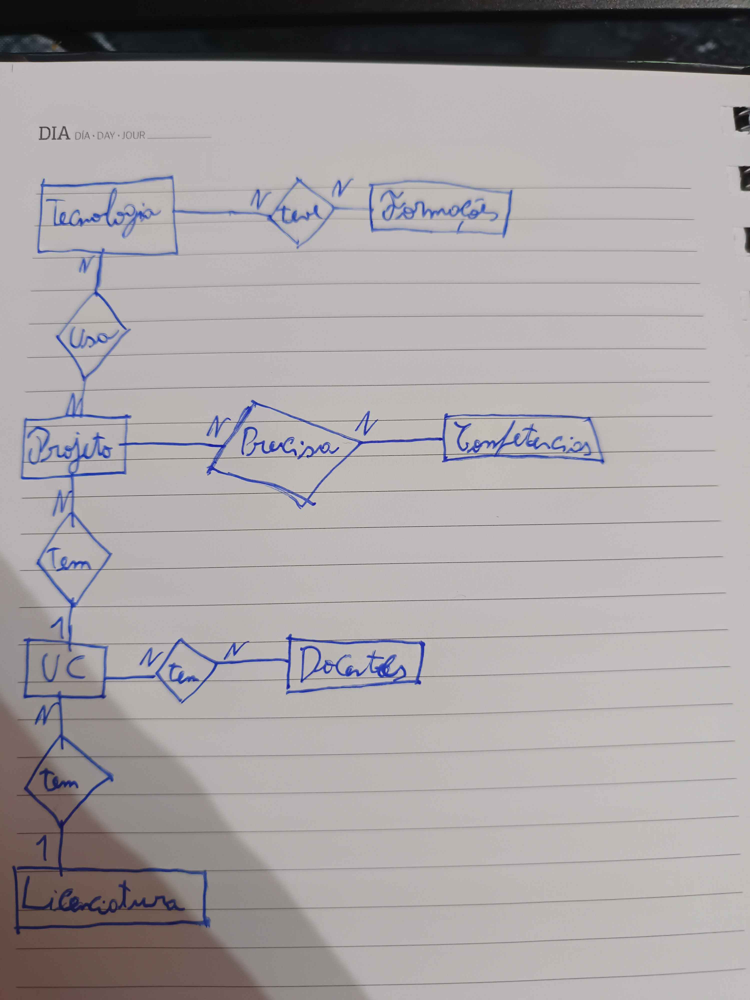

# Making Of

## Entrada 1 — Definição inicial das entidades

**Descrição:**
Para começar, defini as entidades que ia precisar e os respetivos atributos. A ideia inicial era esta:

1. **UC** — nome, ano, semestre, professor, imagem, projeto, codigo_uc
2. **Projeto** — nome, descricao, tecnologia, repositorio, conceitos_aplicados, uc
3. **Licenciatura** — nome, competencia, uc, professor
4. **Tecnologia** — nome, interesse, projeto, site, descricao
5. **TFC** — nome, tecnologia, descricao, email, classificacao
6. **Competencia** — nome, descricao
7. **Formacao** — nome, empresa, descricao
8. **Making Of** — registos_trabalho, descricao_decisoes, erros_encontrados

**Alteração:** Nenhuma, foi a definição inicial.

**Justificação:** Nenhuma, foi a definição inicial.

**Registo em papel:**

---

## Entrada 2 — Revisão das entidades e adição do Docente

**Descrição:**
Ao implementar as entidades no Django apercebi-me que havia atributos mal colocados e que fazia sentido adicionar uma nova entidade — o **Docente**.

**Alteração:**
- Adicionei a entidade Docente
- Removi o atributo `uc` da entidade Projeto
- Mudei `interesse` para `classificacao` na entidade Tecnologia
- Acrescentei o atributo `logo` à entidade Tecnologia

**Justificação:**
A entidade Docente faz sentido existir pois é importante saber quem leciona cada UC. O atributo `uc` no Projeto estava invertido — é a UC que tem um Projeto. O atributo `classificacao` representa melhor o quão à vontade estou com a tecnologia.

**Entidades relacionadas:** Docente, Projeto, Tecnologia

---

## Entrada 3 — Alterações na entidade Competencia e ligação ao Projeto

**Descrição:**
Finalizei a entidade Competencia e liguei-a à entidade Projeto.

**Alteração:**
- Mudei o atributo `nome` para `tipo`
- Adicionei relação N para N entre Projeto e Competencia

**Justificação:**
Faz mais sentido falar em "tipo de competência" do que "nome de competência". A ligação ao Projeto existe porque foi através dos projetos que adquiri as competências.

**Entidades relacionadas:** Competencia, Projeto

---

## Entrada 4 — Ajustes no admin.py

**Descrição:**
Fui ajustando o `list_display` de cada modelo no admin à medida que via que faltava informação útil. Só depois de ver o admin em funcionamento é que reparei que faltavam campos importantes.

**Alteração:**
- Adicionei `email` ao DocenteAdmin
- Adicionei `repositorio` ao ProjetoAdmin
- Adicionei `site_oficial` ao TecnologiaAdmin
- Adicionei `ano` e `semestre` ao UCAdmin

**Justificação:**
São campos importantes para identificar rapidamente cada registo sem ter de abrir o detalhe de cada um.

**Entidades relacionadas:** Docente, Projeto, Tecnologia, UC

---

## Entrada 5 — Alterações nas entidades Docente e Formacao

**Descrição:**
Corrigi o tipo do campo email no Docente e reestruturei a entidade Formacao em relação ao plano original.

**Alteração:**
- Email mudou de `CharField()` para `EmailField()` no Docente
- Na Formacao: `nome` passou a `tipo`, removido `empresa`, acrescentado `data`
- Adicionada ligação entre Formacao e Tecnologia

**Justificação:**
`EmailField()` é mais correto para guardar emails. Nem todas as formações têm nome ou são feitas por empresas. A data é importante para contextualizar quando foi feita a formação. A ligação à Tecnologia existe porque podem existir formações específicas de certas tecnologias.

**Entidades relacionadas:** Docente, Formacao, Tecnologia

---

## Entrada 6 — Alterações na entidade MakingOf

**Descrição:**
A entidade MakingOf ficou bastante diferente do plano original após perceber que os campos genéricos não eram suficientes para estruturar bem a informação.

**Alteração:**
- `registos_trabalho` passou a `fotos`
- Separei a descrição nos campos `alteracao` e `justificacao`
- Adicionei o campo `llm`

**Justificação:**
Campos mais específicos tornam o registo mais organizado. O campo `llm` serve para documentar se e como usei modelos de linguagem em cada etapa, como é pedido no enunciado.

**Entidades relacionadas:** MakingOf

---

## Entrada 7 — Criação da entidade Tfc e correção dos TextField

**Descrição:**
Criei a entidade Tfc com base nos atributos do ficheiro `.json` da ficha 4 de web scraping. Aproveitei também para corrigir os tipos dos campos de descrição em todas as entidades.

**Alteração:**
- Criada entidade Tfc com os atributos `titulo`, `aluno`, `orientador`, `licenciatura`, `pdf`, `mail`, `resumo`, `palavras_chave`, `tecnologias` e `rating`
- Todos os atributos `descricao` passaram de `CharField()` para `TextField()` em todas as entidades

**Justificação:**
`TextField()` é mais correto quando não se sabe o tamanho do texto que vai ser inserido, evitando erros por limite de caracteres.

**Entidades relacionadas:** Tfc

---

## Entrada 8 — Criação do loader_tfc.py

**Descrição:**
Criei o loader para carregar os dados dos TFCs a partir do ficheiro `tfc.json`, seguindo as instruções do professor.

**Alteração:**
- Criada a pasta `data/`
- Criado o ficheiro `loader_tfc.py`

**Justificação:**
O carregamento de dados via loader permite popular a base de dados de forma rápida e repetível, sem ter de inserir os dados manualmente pelo admin.

**Entidades relacionadas:** Tfc

---

## Entrada 9 — Criação do loader_uc.py e carregamento das UCs

**Descrição:**
Usei o script disponibilizado pelo professor que consome uma API da Lusófona para gerar os JSONs das UCs, e criei o loader para as carregar na base de dados. Ao correr o loader deparei-me com um erro num ficheiro específico que era diferente dos restantes — continha informação geral da licenciatura, dos docentes e das UCs em conjunto. Adaptei o loader para usar esse ficheiro como ponto de partida.

**Alteração:**
- Adicionados atributos `ects`, `objetivo` e `programa` à entidade UC
- Removido o atributo `avaliacao`
- Criada a pasta `data/ucs/` com os ficheiros JSON individuais de cada UC
- Ficheiro geral movido diretamente para `data/`

**Justificação:**
O atributo `avaliacao` foi removido porque o campo vinha com código HTML no JSON, o que o tornava inutilizável. A separação entre o ficheiro geral e os ficheiros individuais permitiu ter informação mais completa para cada UC.

**Entidades relacionadas:** UC

---

## Entrada 10 — Criação de um repositório novo

**Descrição:**
O repositório original tinha problemas de configuração que estavam a causar erros ao correr o projeto. Decidi criar um repositório novo e migrar o trabalho para lá.

**Alteração:**
- Criado novo repositório no GitHub
- Migrado todo o código para o novo repositório
- Refeitas as migrações e aplicadas novamente com `makemigrations` e `migrate`

**Justificação:**
O repositório anterior tinha conflitos de configuração entre o nome da pasta do projeto e o nome da app Django, o que causava erros de importação. Criar um repositório novo foi a solução mais limpa para resolver o problema.

**Entidades relacionadas:** —

---

## Entrada 11 — Carregamento dos Docentes no loader_uc.py

**Descrição:**
Acrescentei ao loader_uc.py o carregamento dos dados dos Docentes a partir do ficheiro JSON geral da licenciatura.

**Alteração:**
- Adicionados os atributos `card_code`, `employee_code`, `degree` e `regime` à entidade Docente
- Removido o atributo `site`

**Justificação:**
Estes eram os atributos mais relevantes presentes no JSON. O atributo `site` foi removido porque deixou de fazer sentido após perceber que os dados vinham de uma API e não de um site consultado manualmente.

**Entidades relacionadas:** Docente

---

## Entrada 12 — Carregamento da Licenciatura e correção de erro

**Descrição:**
Adicionei ao loader_uc.py o carregamento dos dados da Licenciatura. Durante os testes detetei um erro em que os ECTS estavam a ser guardados no campo errado.

**Alteração:**
- Carregamento da Licenciatura com os atributos `curso_codigo`, `semestres`, `descricao`, `objetivos` e `curso_ects`
- Corrigido erro em que os ECTS estavam a ser guardados no campo `curso_codigo`

**Justificação:**
Erro detetado ao verificar os dados carregados na base de dados pelo admin. O campo `curso_codigo` estava a receber um valor errado por troca na ordem dos atributos no `create()`.

**Entidades relacionadas:** Licenciatura

---

## Entrada 13 — Adição de blank=True em campos opcionais

**Descrição:**
Tornei opcionais alguns campos que nem sempre têm valor, para evitar erros ao criar registos sem esses dados disponíveis.

**Alteração:**
- Adicionado `blank=True` ao atributo `repositorio` da entidade Projeto
- Adicionado `blank=True` ao atributo `docente` da entidade UC

**Justificação:**
Nem todos os projetos têm repositório. Ao criar as UCs os docentes podem ainda não estar registados na base de dados, por isso o campo tem de ser opcional.

**Entidades relacionadas:** Projeto, UC

---

## Entrada 14 — Criação dos registos de MakingOf e MarkDown

**Descrição:**
Criei todas as entradas do Making Of no admin do Django e elaborei o documento MarkDown com o registo detalhado de todo o processo de desenvolvimento.

**Alteração:**
- Criados 14 registos na entidade MakingOf no admin
- Criado o ficheiro `making_of.md` com todas as entradas documentadas

**Justificação:**
O Making Of é uma componente obrigatória do projeto que permite documentar todas as decisões tomadas ao longo do desenvolvimento, incluindo alterações às entidades, erros encontrados e uso de ferramentas de IA.

**LLM:** Usei o Claude para ajudar a estruturar e redigir o texto do Making Of. O Claude ajudou a organizar a informação por tópicos e a tornar a escrita mais clara e coerente, mas todo o conteúdo e decisões descritas são da minha autoria.

**Entidades relacionadas:** MakingOf
